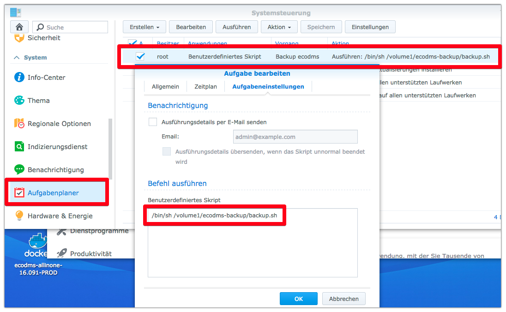

ecodms Document Management System on Synology NAS
=================================================

Table of Contents
=================

   * [ecodms Document Management System on Synology NAS](#ecodms-document-management-system-on-synology-nas)
      * [Why did I choose ecodms](#why-did-i-choose-ecodms)
      * [Installation](#installation)
      * [My ecodms configuration](#my-ecodms-configuration)
         * [classification attributes](#classification-attributes)
         * [document types](#document-types)
      * [REGEX functions I am using](#regex-functions-i-am-using)
         * [Identify everything after a certain word](#identify-everything-after-a-certain-word)
            * [Example 1: "Kontoauszug Nummer 001 / 2011 vom 01.01.2011 bis 05.01.2011"](#example-1-kontoauszug-nummer-001--2011-vom-01012011-bis-05012011)
            * [Example 2: "Abrechnung:         Januar 2011"](#example-2-abrechnung---------januar-2011)
      * [create scheduled task for backup](#create-scheduled-task-for-backup)


Why did I choose ecodms
-----------------------
My requirements were the following:
- My input documents are electronic PDFs and real paper that is scanned and saved to a folder
- I wanted a input folder where I can put the electronically available PDF documents and the scanned paper documents and afterwards these are processed automatically with minimal manual effort 
- Scanned PDFs get OCR'ed to PDF/A automatically (for fulltext index)
- Fulltext search on the context
- I was looking for an affordable system, since I use it for private purpose only

The key features of ecodms I coudld not find in any other open source or affordable document management system were the possibility to automate the process of classification of the document based on keyword searches and automatic extraction of a certain text from the document with the help of regular expressions.


Installation
------------
Follow the installation instructions for Synology NAS in CHapter 4.4 of the ecodms installation guide:
https://www.ecodms.de/index.php/de/download/handbuecher/ecodms-version-16-09-eleanor

My ecodms configuration
-----------------------

### Users

Change the default password of the `ecodms` user, that also has administration privileges.

To create a user that is able to scan, classify and version documents, see the version history and use the web interface, the following roles are required:
- ecoSIMSCLASSIFY
- ecoICELogon
- ecoSIMSVERSIONING
- ecoSIMSHISTORY
- ecoSIMSWEBCLIENT

### Folders

### Classification attributes
I tried to keep the classification attributes as generic as possible, to be able to use it for all kind of document types.
I use "From" (German: Von) to identify the origin/sender of the document. E.g. if it is a bank statement I put in the name of the bank, if it is a product manual I use it to put in the name of the manufacturer, .... To avoid missspelling I use combobox type.
For Invoices I added the field Invoicenumber (German: Rechnungsnummer) with type textfield and in addition a combobox field the number of years of guarantee (German: Garantie).

Name | Type | Combobox values
------------ | ------------- | -------------
Von | Combobox | Yamaha, Thorens, Brother, Apple, Vespa
Rechnungsnummer | Freitext
Garantie | Combobox | 1 Jahr, 2 Jahre, 3 Jahre, 4 Jahre, 5 Jahre

### Document types
Type | Icon
------------ | -------------
Anleitung | 
Rechnung | 
Kontoauszug | 
Kreditkartenabrechnung | 


REGEX functions I am using
--------------------------

### Identify everything after a certain word
#### Example 1: "Kontoauszug Nummer 001 / 2011 vom 01.01.2011 bis 05.01.2011"

To identify everything after the word "Kontoauszug", until the date field in the format "dd.mm.yyyy", e.g.
```
Kontoauszug Nummer 001 / 2011 vom 01.01.2011 bis 05.01.2011
```
I used the following REGEX,

```
REGEX:(?i)\b(?<=Kontoauszug).*\d{2}\.\d{2}\.\d{4}\b
```

which results in:
```
Nummer 001 / 2011 vom 01.01.2011 bis 05.01.2011
```

#### Example 2: "Abrechnung:         Januar 2011"

To identify everything after the word "Abrechnung", until the date field in the format "yyyy", e.g.
```
Abrechnung:         Januar 2011
```
I used the following REGEX,

```
REGEX:(?i)(?<=Abrechnung)[\s|:]+\b.*\d{4}\b
```
which results in:
```
: Januar 2015
```
Unfortunately I did not find a way to eliminate the ":" in the result. Any hint is apreciated.


Create scheduled task for backup
--------------------------------

If the docker service is started on the Synology disk station it does not switch to standby any more and therefore I only start it on purpose, if I need to archive documents or search for documents.

But I wanted to have a regular daily backup of all data, therefore I created the [ecodms/backup.sh](backup.sh) and set up a scheduled task that runs once a day. See https://www.synology.com/en-global/knowledgebase/DSM/help/DSM/AdminCenter/system_taskscheduler for details on setting up a scheduled task on synology.
Make sure you add the shell interpreter (/bin/sh ) before the full path name to the script:



